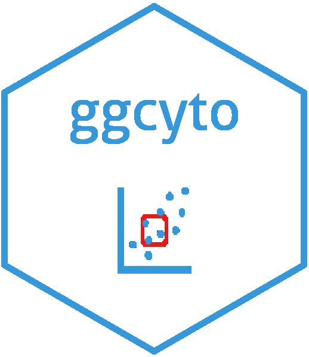
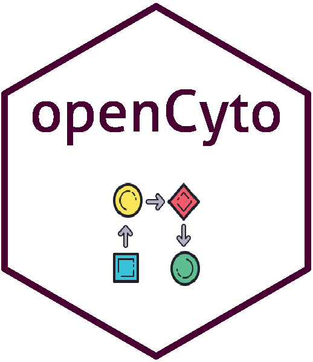

# Hex stickers for R packages of RGLab
<!--

-->

# How to constribute
* Edit `logo_gen.R` within the package subfolder(create one if not already exist)
* Run `logo_gen.R` to generate `logo.png` for the package
* add `img` link to the `README.md`

cytoml Icons made by <a href="https://www.flaticon.com/authors/prettycons" title="prettycons">prettycons</a> from <a href="https://www.flaticon.com/" 			    title="Flaticon">www.flaticon.com</a> is licensed by <a href="http://creativecommons.org/licenses/by/3.0/" 			    title="Creative Commons BY 3.0" target="_blank">CC 3.0 BY</a>
